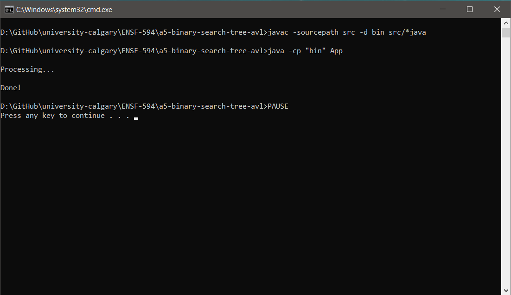

# AVL Tree

This program is the solution to the problem statement given in the file [Questions.pdf](Questions.pdf) using AVL trees.


## How it works

1. User launches the program

1. The program reads the [`input.txt`](input.txt) file

1. The program displays <b>Processing...</b> while it processes the input

1. The program writes the processed output in the files [`AVLtree.txt`](AVLtree.txt)

1. The program exits with the message <b>Done!</b>


## Dependencies

+ JDK 1.7 or above


## How to run

1. Clone the project on your local machine or extract the downloaded the zip archive

1. If using *nix OS
   1. Using the terminal, go to the directory where the project is cloned/extracted
   1. Run the below commands
      ```shell
      chmod +x launch.sh
      ./launch.sh
      ```
   1. Then follow the onscreen instructions, if any

1. If using Windows OS
   1. Navigate to the directory where the project is cloned/extracted
   1. Double click on the file `launch.cmd`
   1. Follow the onscreen instructions, if any


## Execution Screenshots


